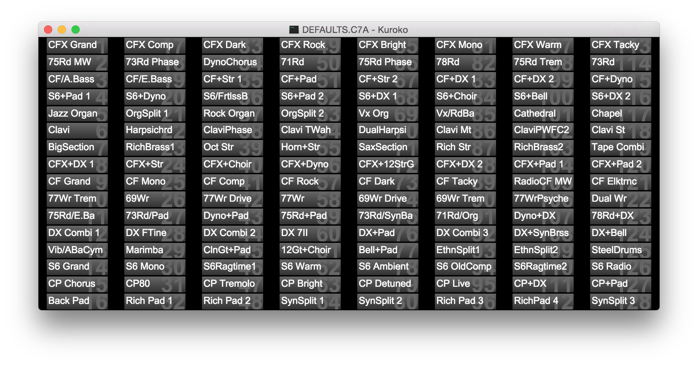

# Kuroko

Kuroko provides a drag-and-drop GUI for rearranging performances in C7A files used by the Yamaha CP4 Stage Piano.

## Usage

1. Export a C7A file from your CP4:
	1. Connect a USB flash drive to the CP4 via the "USB TO HOST" port
	1. Press the FILE button, select `01. Save`, enter a filename, press ENTER, then press YES to confirm
	1. Once complete, disconnect the USB flash drive from the CP4 and connect it to your computer
1. Open the C7A file in Kuroko via the Open menu item or Ctrl/Cmd+O; Kuroko will list its 128 stored performances
1. Drag and drop performances to rearrange them:
	* Dropping near the top/bottom edge of a performance will place the dragged performance in between two
		performances, effectively moving the subsequent performances down
	* Dropping in the middle of a performance will swap its position with the dragged performance
1. Export an updated C7A file via the Save menu item (Ctrl/Cmd+S), or export under a different name via
	Save As... (Ctrl/Cmd+Shift+S)
	* You can also discard unsaved changes and restore the original state of the C7A via the Revert menu item
		(Ctrl/Cmd+Shift+R)
1. Re-import the new C7A to your CP4:
	1. Eject / safely remove the USB flash drive from your computer and reconnect it to the CP4
	1. Press the FILE button, select `02. Load`, select the appropriate file, press ENTER, then press YES to confirm

## Build Instructions

### Setup

1. `npm install`

### Development

1. `grunt dev` (requires `grunt-cli` installed globally)
1. `bin/run`

### Release

`grunt release`

## License

[MIT](LICENSE)
